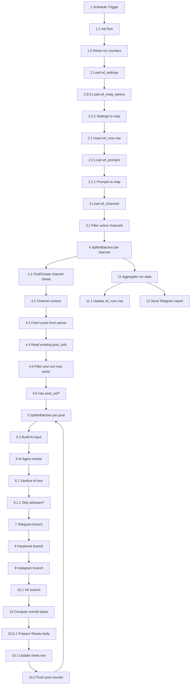

# tg-ai-multipost_vk — актуальное описание workflow и parser-сервера

Документ приведён к состоянию актуального workflow, где VK-ветка уже есть.

---

## 1. Текущее состояние

Workflow:

```text
tg-ai-multipost_vk
```

Запуск:

```text
Schedule Trigger → каждые 25 минут
```

Площадки публикации:

```text
Telegram
Facebook Page
Instagram
VK
```

Ключевые Data Tables:

```text
wf_settings
wf_channels
wf_meta_tokens
wf_prompts
wf_runs
```

---

## 2. Архитектура



---

## 3. Init / настройки

### `2 Load wf_settings`

Загружает глобальные настройки.

Критичные ключи:

```text
parser_url
parser_token
gdrive_folder_id
default_post_limit
report_chat_id

publish_telegram
publish_facebook
publish_instagram
publish_vk

ai_model
caption_long_mode
instagram_poll_max
instagram_poll_delay

cloudinary_cloud_name
cloudinary_upload_preset
cloudinary_folder
```

### `2.0.0 Load wf_meta_tokens`

Загружает токены по ключам.

Используется для:

```text
meta_token_key → fb_access_token
vk_token_key   → vk_access_token
```

### `3.1 Filter active channels`

Берёт только активные каналы и пробрасывает:

```text
channel_key
channel_url
post_limit
target_tg_chat
fb_page_id
ig_business_id
meta_token_key
vk_owner_id
vk_token_key
rewrite_lang
```

### `4.2 Channel context`

Собирает полный контекст канала, включая:

```text
fb_access_token
vk_access_token
publish_vk
cloudinary_*
system_prompt
user_template
```

---

## 4. Parser-сервис

Parser вызывается в:

```text
4.3 Fetch posts from parser
```

URL:

```text
{parser_url}/posts
```

Query:

```text
channel = channel_url
limit   = post_limit
```

Header:

```text
X-Parser-Token = parser_token
```

Parser возвращает:

```text
post_uid
post_id
post_url
date
text
text_plain
text_html
links
photo_url
video_url
media_type
```

`post_uid` — главный ключ дедупликации.

---

## 5. Google Sheets

Для каждого Telegram-канала создаётся Google Sheet:

```text
tg-<channel_key>
```

Лист:

```text
posts
```

Текущая шапка должна быть на 28 колонок:

```text
posts!A1:AB1
```

Колонки:

```text
created_at
updated_at
run_id
channel_key
post_uid
post_id
post_url
post_date
views
source_text
source_text_hash
media_type
photo_url
video_url
rewritten_text
instagram_caption
tg_status
tg_result
fb_status
fb_result
ig_status
ig_result
overall_status
error_message
source_json
vk_status
vk_result
result_json
```

Важно:

```text
10.0.1 Prepare Sheets body формирует 28 значений.
10.1 Update sheet row должен писать в posts!A:AB:append.
```

Если в workflow стоит `posts!A:Z:append`, заменить на:

```text
posts!A:AB:append
```

---

## 6. AI-рерайт

Основные ноды:

```text
5.2 Build AI input
6 AI Agent rewrite
6.0.1 OpenRouter Chat Model
6.1 Sanitize AI text
6.1.1 Skip ad/spam?
```

`rewrite_lang` добавляется в AI-инструкцию как приоритетный язык рерайта.

AI должен вернуть JSON:

```json
{
  "rewritten_text": "",
  "telegram_html": "",
  "facebook_text": "",
  "instagram_caption": "",
  "is_ad": false,
  "skip_post": false,
  "skip_reason": "",
  "warnings": []
}
```

---

## 7. Telegram-ветка

Старт:

```text
7.1 TG enabled?
```

Условие:

```text
publish_telegram = true
target_tg_chat не пустой
```

Медиа-switch:

```text
7.1.1 TG media switch
```

Основные ноды:

```text
7.1.2 TG send photo
7.1.2.2 TG send tail
7.1.3 TG send video
7.1.3.6 TG send video tail
7.1.3.3 TG fallback send photo (thumb)
7.1.3.4 TG fallback text only
7.1.4 TG send text
7.1.5 TG status
7.1.6 TG skipped
7.1.7 Merge TG
```

---

## 8. Facebook-ветка

Старт:

```text
8.1 FB enabled?
```

Условие:

```text
publish_facebook = true
fb_page_id не пустой
fb_access_token не пустой
```

Основные ноды:

```text
8.1.1 FB media switch
8.1.2 FB post photo
8.1.3 FB post video
8.1.4 FB post text
8.1.5 FB status
8.1.6 FB skipped
8.1.7 Merge FB
```

Токен берётся так:

```text
wf_channels.meta_token_key
→ wf_meta_tokens[key].access_token
→ fb_access_token
```

---

## 9. Instagram-ветка

Старт:

```text
9.1 IG eligible?
```

Условие:

```text
publish_instagram = true
ig_business_id не пустой
media_type != none
```

Фото:

```text
9.1.0.5 Upload photo to Cloudinary
9.1.1.1 IG create photo container
```

Видео:

```text
9.1.0.1 Download IG video binary
9.1.0.2 Fix IG video binary metadata
9.1.0.3 Upload IG video to Cloudinary
9.1.0.4 Save IG public video URL
9.1.1.2 IG create video container
```

Общий путь:

```text
9.1.2 IG wait for container
9.1.3 IG container status
9.1.4 IG ready?
9.1.5 IG publish
9.1.6 IG status
9.1.7 IG not ready
9.1.8 IG skipped
9.1.9 Merge IG
```

---

## 10. VK-ветка

VK-ветка стартует после Instagram merge.

### `10.1.0 VK enabled?`

Условие:

```text
skip_post != true
publish_vk = true
vk_owner_id не пустой
vk_access_token не пустой
```

### `10.1.1 VK media switch`

Ветки:

```text
photo
video
fallback/text
```

### Фото-публикация VK

```text
10.1.2 VK get photo upload server
10.1.2.1 VK download photo
10.1.2.2 VK upload photo
10.1.2.3 VK save photo
10.1.2.4 VK wall post photo
10.1.5 VK status
```

Логика:

```text
photos.getWallUploadServer
→ upload photo на upload_url
→ photos.saveWallPhoto
→ wall.post с attachments=photo{owner_id}_{id}
```

### Видео-публикация VK

```text
10.1.4 VK video save
10.1.4.1 VK download video
10.1.4.2 VK upload video
10.1.5 VK status
```

Логика:

```text
video.save
→ upload video на response.upload_url
→ статус через 10.1.5 VK status
```

### Текстовый пост VK

```text
10.1.3 VK post text
10.1.5 VK status
```

Метод:

```text
wall.post
```

### VK skipped

Если VK выключен или не заполнены данные:

```text
10.1.6 VK skipped
```

Ожидаемые поля:

```text
vk_status
vk_result
```

---

## 11. Финальный статус

### `10 Compute overall status`

Считает общий статус по:

```text
tg_status
fb_status
ig_status
vk_status
```

`result_json` включает:

```json
{
  "tg": {},
  "fb": {},
  "ig": {},
  "vk": {}
}
```

### `10.0.1 Prepare Sheets body`

Готовит строку для Google Sheets, включая:

```text
vk_status
vk_result
```

---

## 12. Отчёт

Финальные ноды:

```text
11 Aggregate run stats
11.05 Should log?
11.1 Update wf_runs row
11.1 Send report?
12 Send Telegram report
```

Отчёт уходит в:

```text
wf_settings.report_chat_id
```

---

## 13. Что проверить перед запуском VK

В `wf_settings`:

```text
publish_vk = true
```

В `wf_channels`:

```text
vk_owner_id = -ID_ГРУППЫ
vk_token_key = vk_bginfo
```

В `wf_meta_tokens`:

```text
key = vk_bginfo
access_token = long-lived user token
```

Токен должен быть:

```text
user access token
expires_in=0
```

Проверочные VK-запросы описаны в:

```text
VK_N8N_WORKING_TOKEN_AND_TABLES_GUIDE.md
```

---

## 14. Важные замечания

1. Community/group token для VK-медиа не использовать.
2. Для фото нужен user token, потому что `photos.getWallUploadServer` не работает с group auth.
3. Для Sheets должен быть диапазон `A:AB`, потому что есть `vk_status` и `vk_result`.
4. В `wf_channels` должно быть поле `rewrite_lang`.
5. Если `publish_vk=false`, VK-ветка уходит в skipped.
